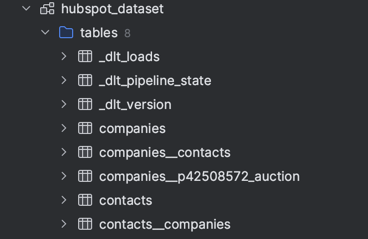
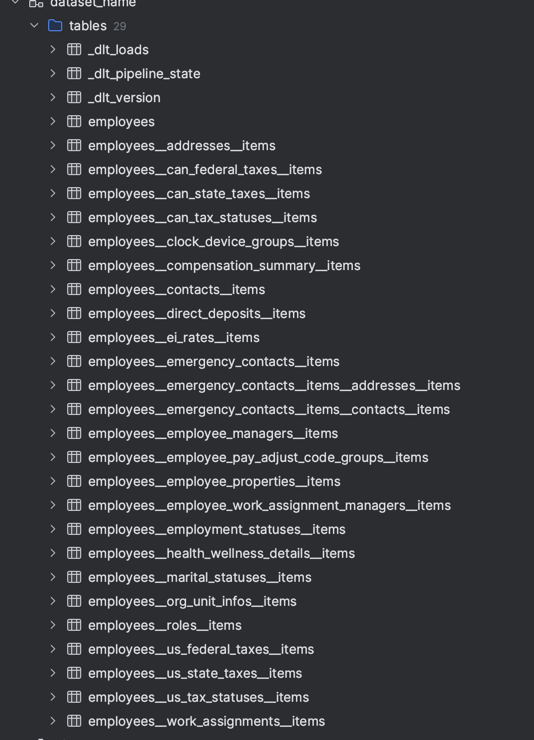

The core logic for extracting and ingesting the data resides in below directory
    - `dayforce`
    -  `hubspot`

The developed solution is first run in local using python by running specific pipeline

`dayforce_pipeline.py` for running the dayforce pipeline
`hubspot_pipeline.py` for running the hubspot pipeline

The scripts can be executed using python

After running the pipelines from local below are the list of tables generated in the local duckdb database

To schedule and automate this, we use airflow ( since we already have an airflow instance in `reporting` account). `aws-mwaa-local-runner` is used for running a local instance of airflow

airflow dags (pipelines) created:

`dayforce_pipeline_dag.py` for running dayforce pipeline
`hubspot_pipeline_dag.py` for running hubspot pipeline

This is how the
